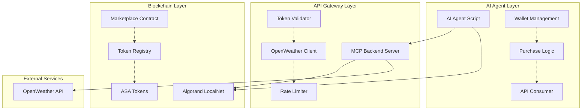

# Architecture Documentation: Tokenized Weather API Access

## System Overview

This system demonstrates a novel approach to API monetization through blockchain tokenization. Instead of traditional API keys or subscription models, access to weather data is controlled by owning specific Algorand Standard Assets (ASAs) that represent time-limited access rights.

## High-Level Architecture



## Component Architecture

### 1. AI Agent Layer

#### Agent Core (`agent/agent.py`)
The AI agent simulates an autonomous system that needs weather data and can purchase access when denied.

**Key Components:**
- **Wallet Manager**: Handles private key management and transaction signing
- **Purchase Engine**: Automatically buys tokens when access is denied
- **API Client**: Makes requests to the MCP backend
- **Decision Logic**: Determines when to buy, use, or resell tokens

**Flow:**
1. Attempt weather API call
2. If denied (403), analyze error response
3. Calculate cost-benefit of purchasing token
4. Execute purchase transaction
5. Retry API call with valid token
6. Optionally list unused tokens for resale

#### Wallet Architecture
```python
class AgentWallet:
    def __init__(self, mnemonic: str):
        self.private_key = mnemonic.to_private_key()
        self.address = account.address_from_private_key(self.private_key)
        self.algod_client = algod.AlgodClient(...)
    
    def get_balance(self) -> int:
        """Get ALGO balance"""
    
    def get_tokens(self) -> List[AssetHolding]:
        """Get all ASA tokens owned"""
    
    def buy_weather_token(self) -> str:
        """Purchase weather access token"""
    
    def validate_token_access(self, token_id: int) -> bool:
        """Check if token is valid for API access"""
```

### 2. API Gateway Layer

#### MCP Backend Server (`backend/main.py`)
FastAPI-based server that acts as a proxy between agents and OpenWeather API, with blockchain-based access control.

**Architecture:**
```python
app = FastAPI()

@app.middleware("http")
async def token_validation_middleware(request, call_next):
    """Validate token ownership for protected routes"""

@app.get("/weather")
async def get_weather(city: str, wallet: str):
    """Main weather endpoint with token gating"""

@app.get("/tokens/{wallet}")
async def get_wallet_tokens(wallet: str):
    """Token information endpoint"""
```

**Key Modules:**

1. **Token Validator** (`backend/validators.py`):
   - Queries Algorand network for token ownership
   - Checks token expiry timestamps
   - Validates token type and metadata

2. **OpenWeather Client** (`backend/weather_client.py`):
   - Handles OpenWeather API integration
   - Manages API key and rate limiting
   - Formats weather data responses

3. **Blockchain Interface** (`backend/blockchain.py`):
   - Algorand SDK wrapper
   - Smart contract interaction
   - Transaction validation

### 3. Blockchain Layer

#### Smart Contract Architecture (`smart_contracts/weather_marketplace.py`)

**Contract State:**
```python
class WeatherMarketplace(beaker.Application):
    # Global state
    admin: beaker.ApplicationStateValue = beaker.ApplicationStateValue(
        stack_type=TealType.bytes,
        key=Bytes("admin"),
    )
    
    token_price: beaker.ApplicationStateValue = beaker.ApplicationStateValue(
        stack_type=TealType.uint64,
        key=Bytes("price"),
    )
    
    weather_asa_id: beaker.ApplicationStateValue = beaker.ApplicationStateValue(
        stack_type=TealType.uint64,
        key=Bytes("asa_id"),
    )
```

**Key Methods:**

1. **Token Creation**:
   ```python
   @beaker.external
   def create_weather_tokens(self, quantity: pt.Expr) -> pt.Expr:
       """Mint new weather access tokens"""
   ```

2. **Purchase Logic**:
   ```python
   @beaker.external
   def buy_token(self, payment: pt.Expr) -> pt.Expr:
       """Purchase weather access token with ALGO"""
   ```

3. **Validation**:
   ```python
   @beaker.external(read_only=True)
   def validate_access(self, wallet: pt.Expr, token_id: pt.Expr) -> pt.Expr:
       """Validate token ownership and expiry"""
   ```

#### Token Design

**ASA Properties:**
- **Asset Name**: "OpenWeather Access Token"
- **Unit Name**: "OWAT"
- **Total Supply**: 1000 (configurable)
- **Decimals**: 0
- **Manager**: Marketplace contract address
- **Freeze/Clawback**: Disabled for decentralization

**Metadata (ARC-19):**
```json
{
  "name": "OpenWeather Access Token",
  "description": "1-hour access to OpenWeather API data",
  "image": "ipfs://...",
  "properties": {
    "duration_hours": 1,
    "api_type": "weather",
    "max_requests": 100,
    "expires_at": "2024-12-01T15:30:00Z"
  }
}
```

### 4. Data Flow Architecture

#### Request Flow
1. **Agent → MCP Backend**: Weather request with wallet address
2. **MCP Backend → Algorand**: Validate token ownership
3. **Algorand → MCP Backend**: Token validation result
4. **MCP Backend → OpenWeather**: API call (if valid)
5. **OpenWeather → MCP Backend**: Weather data
6. **MCP Backend → Agent**: Formatted response

#### Purchase Flow
1. **Agent → Algorand**: Query marketplace for available tokens
2. **Agent → Algorand**: Submit purchase transaction
3. **Algorand → Agent**: Transaction confirmation + token transfer
4. **Agent → MCP Backend**: Retry weather request with new token

## Security Architecture

### 1. Smart Contract Security
- **Access Control**: Admin-only functions for contract management
- **Input Validation**: All user inputs validated on-chain
- **Overflow Protection**: SafeMath operations for ALGO amounts
- **Reentrancy Protection**: State updates before external calls

### 2. API Security
- **Token Validation**: Every request validated against blockchain state
- **Rate Limiting**: IP-based and wallet-based rate limiting
- **API Key Protection**: OpenWeather key stored server-side only
- **Input Sanitization**: All user inputs sanitized

### 3. Agent Security
- **Wallet Security**: Private keys stored securely (local only)
- **Transaction Limits**: Maximum spend limits to prevent abuse
- **Network Security**: TLS for all external communications

## Scalability Architecture

### 1. Horizontal Scaling
- **Load Balancer**: Multiple MCP backend instances
- **Database**: PostgreSQL for caching and analytics
- **Message Queue**: Redis for async processing

### 2. Blockchain Scaling
- **Batch Processing**: Multiple token operations in single transaction
- **State Optimization**: Efficient global state management
- **Indexer Usage**: Fast queries via Algorand Indexer

### 3. Caching Strategy
- **Token Cache**: In-memory cache of valid tokens (5-minute TTL)
- **Weather Cache**: Cache weather data for 10 minutes per city
- **Blockchain Cache**: Cache contract state for faster validation

## Monitoring Architecture

### 1. Application Monitoring
- **Health Endpoints**: `/health` for system status
- **Metrics**: Prometheus metrics for API calls, token usage
- **Logging**: Structured logging with correlation IDs

### 2. Blockchain Monitoring
- **Transaction Monitoring**: Track all marketplace transactions
- **Token Analytics**: Monitor token creation, sales, expiry
- **Network Health**: Algorand node status monitoring

### 3. Business Metrics
- **Revenue Tracking**: ALGO earned from token sales
- **Usage Analytics**: API call patterns and frequency
- **Agent Behavior**: Purchase patterns and token utilization

## Deployment Architecture

### 1. Development Environment
```bash
# LocalNet setup
algokit localnet start

# Smart contract deployment
algokit project run build
algokit project deploy localnet

# Backend server
cd backend && uvicorn main:app --reload

# Agent simulation
cd agent && python agent.py
```

### 2. Production Considerations
- **Network**: Algorand TestNet/MainNet
- **Infrastructure**: Docker containers with orchestration
- **SSL**: HTTPS for all API endpoints
- **Backup**: Smart contract state backup and recovery

## Integration Patterns

### 1. MCP (Model Context Protocol) Compliance
The backend server follows MCP patterns for AI agent integration:
- **Tool Discovery**: Agents can discover available weather APIs
- **Error Handling**: Standardized error responses
- **Authentication**: Blockchain-based auth instead of API keys

### 2. Webhook Integration
- **Token Events**: Webhooks for token purchases/expiry
- **Usage Notifications**: Real-time usage alerts
- **Payment Confirmations**: Transaction completion notifications

This architecture provides a robust, scalable, and secure foundation for tokenized API access, demonstrating how blockchain technology can revolutionize traditional API business models.